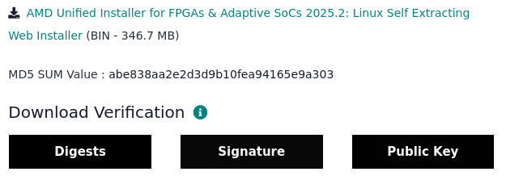
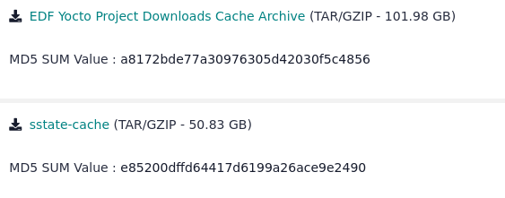
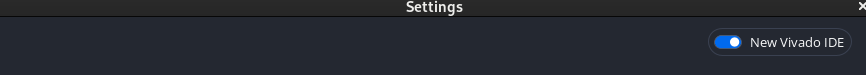
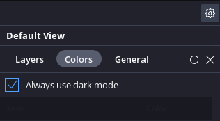
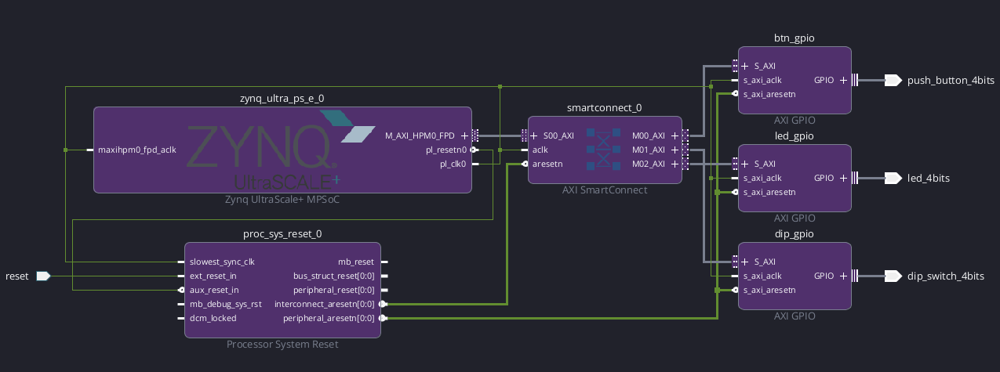
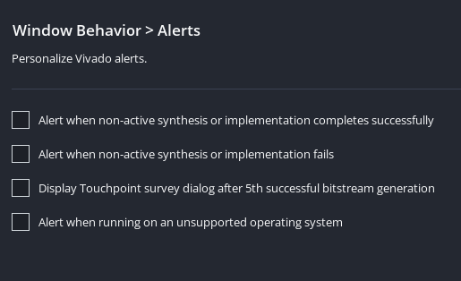
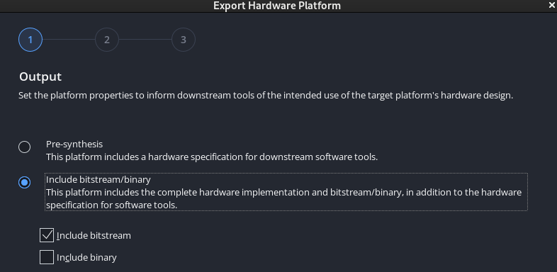
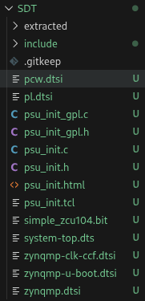
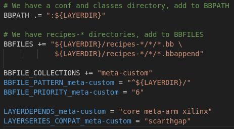

# Yocto-ZCU104

This project will *thoroughly* document from **start to finish** creating a simple project in Vivado to making a simple INITRAMFS image in AMD's new [Embedded Development Framework (Yocto flow)](https://xilinx-wiki.atlassian.net/wiki/spaces/A/pages/3250585601/AMD+Embedded+Development+Framework+EDF). The purpose of this is to be a reference model for Yocto-based projects moving forward as I've been so used to the old PetaLinux flow.

**Warning: PetaLinux is planned to be officially deprecated after the 2026.2 release**

## Overview

- Project Version: 2025.2
- OS Version: Alma Linux 9.7
- Yocto Upstream Version: Scarthgap LTS (v5.0)
- FPGA: [AMD Zynq Ultrascale+ MPSoC ZCU104](https://www.amd.com/en/products/adaptive-socs-and-fpgas/evaluation-boards/zcu104.html)

## Installation

- Dependency Installs
    - `$ gsettings set org.gnome.desktop.wm.preferences button-layout ":minimize,maximize,close"`
    - `$ sudo dnf update`
    - `$ sudo dnf install epel-release dnf-plugins-core`
    - `$ sudo dnf config-manager --set-enabled crb`
    - `$ sudo dnf makecache`
    - `$ sudo dnf install autoconf automake bzip2 ccache chrpath cpio cpp diffstat diffutils gawk gcc gcc-c++ git glib2-devel glibc-devel glibc-langpack-en glibc-locale-source gzip latexmk libacl librsvg2-tools libtool lz4 make ncurses ncurses-devel openssl openssl-devel patch perl perl-Data-Dumper perl-Text-ParseWords perl-Thread-Queue python3 python3-GitPython python3-jinja2 python3-pexpect python3-pip repo rpcgen socat tar texinfo texlive-collection-fontsrecommended texlive-collection-latex texlive-collection-latexrecommended texlive-collection-xetex texlive-fncychap texlive-gnu-freefont texlive-tex-gyre texlive-xetex uboot-tools unzip wget which xterm xz zlib zlib-devel zstd`
    - `$ sudo pip3 install sphinx sphinx_rtd_theme pyyaml`
    - `$ localectl`
        - Locale should be set to "LANG=en_US.UTF-8"
        - In case if it's not: `$ sudo localectl set-locale LANGE=en_US.UTF-8`

- Vivado Install
    - Go to [Vivado Downloads](https://www.xilinx.com/support/download.html)
        - 
    - `$ sudo mkdir -p /opt/Xilinx`
    - `$ sudo chown -R $USER:$USER /opt/Xilinx`
    - `$ chmod +x ~/Downloads/FPGAs_AdaptiveSoCs_Unified_SDI_2025.2_1114_2157_Lin64.bin`
    - Install Vivado with the Self Extracting Installer
        - **Warning: AMD Account Required!!!**
        - `$ ~/Downloads/FPGAs_AdaptiveSoCs_Unified_SDI_2025.2_1114_2157_Lin64.bin`
    - Vivado is installed under: */opt/Xilinx/2025.2/Vivado*

- Yocto Artifacts (Downloads + Sstate Cache)
    - Go to [Embedded Software](https://www.xilinx.com/support/download/index.html/content/xilinx/en/downloadNav/embedded-design-tools.html)
        - 
        - **Warning: AMD Account Required!!!**
    - `$ mkdir -p /opt/Xilinx/2025.2/Yocto`
    - `$ tar -xpvf ~/Downloads/downloads_edf_25.11_11151020.tar.gz -C /opt/Xilinx/2025.2/Yocto`
    - `$ tar -xpvf ~/Downloads/sstate-cache_edf_25.11_11151020.tar.gz -C /opt/Xilinx/2025.2/Yocto`

- Optional: Visual Studio Code
    - `$ sudo rpm --import https://packages.microsoft.com/keys/microsoft.asc`
    - `$ echo -e "[code]\nname=Visual Studio Code\nbaseurl=https://packages.microsoft.com/yumrepos/vscode\nenabled=1\nautorefresh=1\ntype=rpm-md\ngpgcheck=1\ngpgkey=https://packages.microsoft.com/keys/microsoft.asc" | sudo tee /etc/yum.repos.d/vscode.repo > /dev/null`
    - `$ dnf check-update`
    - `$ sudo dnf install code`
    - Extensions
        - C/C++
        - Makefile Tools
        - Python
        - Bash IDE
        - Embedded Linux Kernel Dev
        - Yocto Project BitBake
        - Verilog-HDL

## Vivado

After installing everything I need, open Vivado.

- `$ cd ~/workspace/Yocto-ZCU104/Vivado`
- `$ source /opt/Xilinx/2025.2/Vivado/settings64.sh`
- `$ vivado`

I'm going to start with the PL design using Vivado. The PL design will be pretty simple. It will only use the LEDs, push buttons, and DIP switches included into the ZCU104 via AXI GPIO.

*I'm able to enable Dark Mode with these settings:*






Block Design:



For some reason, Vivado tries to request screen sharing when I compile. To stop this, I had to disable the alerts (Settings --> Tool Settings --> Window Behavior --> Alerts):



After generating the bitstream, I exported the hardware platform.




After generating the XSA, I created the System Device Tree (SDT) using `SDTGen`.

- `$ sdtgen`
- `% set_dt_param -dir ../SDT -xsa ./Simple.xsa`
- `% generate_sdt`
- `% exit`

This is what the generated SDT looks like:



**TODO: I would like for there to be a script to automate the SDT generation process**

## Yocto

I have generated an XSA and derived the SDT ([System Device Tree](https://static.linaro.org/connect/lvc20/presentations/LVC20-314-0.pdf)) from it. Now it's time to create the Yocto project. **The goal is to create an INITRAMFS-based image that will start a `systemd` service. This service will autostart a `TCP server`.**

### Getting Yocto Manifests Repo

To start with AMD's EDF, I need to use `repo` (this was installed in the [Installation section](#installation)) to grab the necessary components to build our image for ZCU104.

- `$ cd ~/workspace/Yocto-ZCU104/Yocto`
- `$ repo init -u https://github.com/Xilinx/yocto-manifests.git -b rel-v2025.2 -m default-edf.xml`
- `$ repo sync`

With the `repo sync` command, we now should have everything for EDF. However, I'm going to remove repo's metadata and all of the layer's git metadata so our larger git project will add and push to my repo. **Yes, I know I'm not supposed to do this, but I don't care for this demo until I know of a better way to version control this project.**

- `$ rm -rfv ./.repo/`
- `$ rm -v ./sources/*/.git`
- `$ rm -v ./sources/meta-xilinx/meta-xilinx-core/gen-machine-conf/.git`
- `$ rm -rfv ./sources/{meta-rauc,meta-ros}/.github`
- `$ rm -v ./sources/{meta-ros,meta-xilinx}/.gitmodules`

### Sourcing Yocto Development

Now we've got all the layers we need to start, let's source the Yocto environment.

- `$ source ./edf-init-build-env`

After doing this, you should now be put into a build folder. **Note: From now on, for all subsequent commands, this guide will assume you are located in the build folder.**

Let's create our own layer to put our own modifications and applications:
- `bitbake-layers create-layer ../sources/meta-custom`
- `bitbake-layers add-layer ../sources/meta-custom`

Now I want to do some extra things. I want to create a "reference" *bblayers.conf* and *local.onf*:
- bblayers.conf: BitBake uses this to find the paths of all the available layers
- local.conf: Our top level Yocto configuration file

The reason I want to do this is because, traditionally, you're not supposed to version control your build. But unfortunately, I don't know how to structure Yocto projects correctly for our version control cases yet. So, I'll just do the cheap thing which is extend the `edf-init-build-env` script to copy the reference files to the build.

1. `$ chmod 755 ../edf-init-build-env`
2. `$ cp ./conf/bblayers.conf ../reference-bblayers.conf`
3. `$ cp ./conf/local.conf ../reference-local.conf`
4. Edit reference bblayers conf

```
# POKY_BBLAYERS_CONF_VERSION is increased each time build/conf/bblayers.conf
# changes incompatibly
POKY_BBLAYERS_CONF_VERSION = "2"

BBPATH = "${TOPDIR}"
BBFILES ?= ""

YOCTOROOT = "${@os.path.abspath(os.path.join("${TOPDIR}", os.pardir))}"

BBLAYERS ?= " \
  ${YOCTOROOT}/sources/poky/meta \
  ${YOCTOROOT}/sources/poky/meta-poky \
  ${YOCTOROOT}/sources/poky/../meta-openembedded/meta-oe \
  ${YOCTOROOT}/sources/poky/../meta-openembedded/meta-python \
  ${YOCTOROOT}/sources/poky/../meta-openembedded/meta-filesystems \
  ${YOCTOROOT}/sources/poky/../meta-openembedded/meta-networking \
  ${YOCTOROOT}/sources/poky/../meta-openembedded/meta-multimedia \
  ${YOCTOROOT}/sources/poky/../meta-openembedded/meta-webserver \
  ${YOCTOROOT}/sources/poky/../meta-virtualization \
  ${YOCTOROOT}/sources/poky/../meta-security \
  ${YOCTOROOT}/sources/poky/../meta-security/meta-tpm \
  ${YOCTOROOT}/sources/poky/../meta-xilinx/meta-xilinx-core \
  ${YOCTOROOT}/sources/poky/../meta-xilinx/meta-xilinx-standalone \
  ${YOCTOROOT}/sources/poky/../meta-xilinx/meta-xilinx-standalone-sdt \
  ${YOCTOROOT}/sources/poky/../meta-xilinx/meta-xilinx-multimedia \
  ${YOCTOROOT}/sources/poky/../meta-xilinx/meta-xilinx-demos \
  ${YOCTOROOT}/sources/poky/../meta-xilinx/meta-xilinx-virtualization \
  ${YOCTOROOT}/sources/poky/../meta-xilinx/meta-xilinx-mali400 \
  ${YOCTOROOT}/sources/poky/../meta-xilinx/meta-xilinx-gpu-malig78ae \
  ${YOCTOROOT}/sources/poky/../meta-xilinx/meta-microblaze \
  ${YOCTOROOT}/sources/poky/../meta-xilinx-tsn \
  ${YOCTOROOT}/sources/poky/../meta-openamp \
  ${YOCTOROOT}/sources/poky/../meta-amd-edf \
  ${YOCTOROOT}/sources/poky/../meta-kria \
  ${YOCTOROOT}/sources/poky/../meta-amd-adaptive-socs/meta-amd-adaptive-socs-core \
  ${YOCTOROOT}/sources/poky/../meta-amd-adaptive-socs/meta-amd-adaptive-socs-bsp \
  ${YOCTOROOT}/sources/poky/../meta-xilinx/meta-xilinx-imgrcvry \
  ${YOCTOROOT}/sources/poky/../meta-arm/meta-arm \
  ${YOCTOROOT}/sources/poky/../meta-arm/meta-arm-toolchain \
  ${YOCTOROOT}/sources/poky/../meta-jupyter \
  ${YOCTOROOT}/sources/poky/../meta-ros/meta-ros-common \
  ${YOCTOROOT}/sources/poky/../meta-ros/meta-ros2 \
  ${YOCTOROOT}/sources/poky/../meta-ros/meta-ros2-jazzy \
  ${YOCTOROOT}/sources/poky/../meta-qt5 \
  ${YOCTOROOT}/sources/poky/../meta-vitis \
  ${YOCTOROOT}/sources/meta-custom \
  "
```

5. Edit reference local conf

```
# Source and Sstate mirror settings
AMD-EDF_VERSION = "25.11"

BB_NO_NETWORK = "1"
INHERIT += "own-mirrors"
SOURCE_MIRROR_URL = "file:///opt/Xilinx/2025.2/Yocto/downloads"
SSTATE_MIRRORS = "file://.* file:///opt/Xilinx/2025.2/Yocto/sstate-cache/PATH"
```

6. Edit edf-init-build-env

```
rm -v $ROOT/build/conf/{bblayers.conf,local.conf}
ln -sv $ROOT/reference-bblayers.conf $ROOT/build/conf/bblayers.conf
ln -sv $ROOT/reference-local.conf $ROOT/build/conf/local.conf
```

7. `$ cd ../ && source ./edf-init-build-env`
    - Now from now on, the bblayers.conf and local.conf should point to the reference confs that will be pushed to the remote repo.

### Import System Device Tree

After creating my custom layer (meta-custom), I edit the layer.conf to add dependencies and import the SDT:

- `$ rm -rfv ../sources/meta-custom/recipes-example/`
- `$ vim ../sources/meta-custom/conf/layer.conf`

 

- `$ gen-machine-conf parse-sdt --hw-description ../../SDT --machine-name zcu104 --config-dir ../sources/meta-custom/conf/`
    - Set MACHINE = "zcu104" in local.conf

### Device Tree Configuration

Now that we've imported our device tree, now we have to add modifications to our DTS such as attaching the `genirq` UIO drivers to our IP blocks. This will allow us to access our PL IPs from userspace as `/dev/uio(X)`.

- `$ mkdir -p ../sources/meta-custom/recipes-bsp/device-tree/files`
- `$ vim ../sources/meta-custom/recipes-bsp/device-tree/files/dts-mods.dtsi`

```
/ {
    // AMD Zynq Ultrascale+ MPSoC ZCU104
    model = "Zynq MPSoC ZCU104 Development Board";
    compatible = "xlnx,zynqmp";

    // Boot Arguments
    chosen {
        bootargs = "console=ttyPS0,115200 earlycon earlyprintk clk_ignore_unused irqpoll cpuidle.off=1 uio_pdrv_genirq.of_id=generic-uio";
        stdout-path = "serial0:115200n8";
    };
};

// Processing System
&amba {
    // Ethernet
    gem3: ethernet@ff0e0000 {
        status = "okay";
        local-mac-address = [00 0a 35 00 1e 53];
    };
};

// Programmable Logic
&amba_pl {
    //uio0
    btn_gpio: gpio@a0000000 {
        compatible = "generic-uio";
        reg = <0x0 0xa0000000 0x0 0x10000>;
    };

    //uio1
    dip_gpio: gpio@a0010000 {
        compatible = "generic-uio";
        reg = <0x0 0xa0010000 0x0 0x10000>;
    };

    //uio2
    led_gpio: gpio@a0020000 {
        compatible = "generic-uio";
        reg = <0x0 0xa0020000 0x0 0x10000>;
    };
};
```

- `$ vim ../sources/meta-custom/recipes-bsp/device-tree/device-tree.bbappend`
```
FILESEXTRAPATHS:prepend := "${THISDIR}/files:"

SRC_URI:append = " file://dts-mods.dtsi"
EXTRA_DT_INCLUDE_FILES:append:linux = " dts-mods.dtsi"
EXTRA_DT_INCLUDE_FILES:append:linux-gnueabi = " dts-mods.dtsi"
```

### Kernel Configuration

We now have our device tree accounted for! Now let's configure the kernel to build the UIO platform drivers into.

- `$ mkdir -p ../sources/meta-custom/recipes-kernel/linux-xlnx/files`
- `$ touch ../sources/meta-custom/recipes-kernel/linux-xlnx/files/kernel.cfg`
- `$ bitbake virtual/kernel -c menuconfig`
    - CONFIG_UIO_PDRV_GENIRQ=y
    - CONFIG_UIO_DMEM_GENIRQ=y
    - CONFIG_UIO_XILINX_AI_ENGINE=y
- `$ bitbake virtual/kernel -c diffconfig`
    - This command will generate a diffconfig. Merge the diffs into *../sources/meta-custom/recipes-kernel/linux-xlnx/files/kernel.cfg*
- `$ vim ../sources/meta-custom/recipes-kernel/linux-xlnx_%.bbappend`

```
FILESEXTRAPATHS:prepend := "${THISDIR}/files:"

SRC_URI += "file://kernel.cfg"
```

- `$ bitbake virtual/bootloader -c cleansstate`

### U-Boot Configuration

I will do the same thing for U-Boot, but I will not only configure U-Boot, but I will also create my own U-Boot script.


- `$ mkdir -p ../sources/meta-custom/recipes-bsp/u-boot/files`
- `$ touch ../sources/meta-custom/recipes-bsp/u-boot/u-boot-edf-scr_%.bbappend`
- `$ touch ../sources/meta-custom/recipes-bsp/u-boot/u-boot-xlnx_%.bbappend`
- `$ touch ../sources/meta-custom/recipes-bsp/u-boot/files/custom.boot.cmd`
- `$ touch ../sources/meta-custom/recipes-bsp/u-boot/files/platform-top.h`
- `$ touch ../sources/meta-custom/recipes-bsp/u-boot/files/u-boot.cfg`
- `$ bitbake virtual/bootloader -c menuconfig`
    - CONFIG_SYS_CONFIG_NAME="platform-top"
    - CONFIG_BOOT_SCRIPT_OFFSET=0x03280000
    - CONFIG_QSPI_BOOT=y
    - CONFIG_SD_BOOT=y
    - CONFIG_SD_BOOT_QSPI=y
    - CONFIG_BOOTDELAY=0
    - CONFIG_ENV_IS_DEFAULT=y
    - \# CONFIG_ENV_IS_IN_FAT is not set
    - \# CONFIG_ENV_IS_IN_NAND is not set
    - \# CONFIG_ENV_IS_IN_SPI_FLASH is not set
    - CONFIG_NET_RANDOM_ETHADDR=n
    - CONFIG_SPI_FLASH_BAR=n
    - CONFIG_MTD_NOR_FLASH=y

- `$ bitbake virtual/bootloader -c diffconfig`
    - After this command, you will be given a path for a .cfg file. Merge the differences from that .cfg and place them into: *../sources/meta-custom/recipes-bsp/u-boot/files/u-boot.cfg*
- `$ bitbake virtual/bootloader -c cleansstate`

Now to edit the top platform header. We need to expand the default boot length. Because we're using an INITRAMFS image, the boot image will be quite larger than normal. By default, most bootloaders have a boot length cap. I don't know what exactly that length limit is, but we can explicitly define a limit.

- `$ vim ../sources/meta-custom/recipes-bsp/u-boot/files/platform-top.h`

```
#if defined(CONFIG_MICROBLAZE)
#include <configs/microblaze-generic.h>
#define CONFIG_SYS_BOOTM_LEN 0xF000000
#endif
#if defined(CONFIG_ARCH_ZYNQ)
#include <configs/zynq-common.h>
#undef CONFIG_SYS_BOOTMAPSZ
#define CONFIG_SYS_BOOTM_LEN 0x0C800000
#endif
#if defined(CONFIG_ARCH_ZYNQMP)
#include <configs/xilinx_zynqmp.h>
#undef CONFIG_SYS_BOOTMAPSZ
#define CONFIG_SYS_BOOTM_LEN 0x12C00000
#endif
#if defined(CONFIG_ARCH_VERSAL)
#include <configs/xilinx_versal.h>
#endif
#if defined(CONFIG_ARCH_VERSAL_NET)
#include <configs/xilinx_versal_net.h>
#endif
```

Last thing to edit, we'll edit the boot script that will eventually become the `boot.scr` file. This file assists the U-Boot bootloader to find the FIT image and load it into memory by the specified addresses.

- `$ vim ../sources/meta-custom/recipes-bsp/u-boot/files/custom.boot.cmd`

```
# This is a boot script for U-Boot (only supported modes are SD and QSPI).
# Generate boot.scr:
# mkimage -c none -A arm -T script -d custom.boot.cmd boot.scr

fit_name=image.ub
load_addr=0x10000000
fit_offset=0x03300000
fit_size=0x12C00000

for boot_target in ${boot_targets};
do
    echo "Trying to load boot images from ${boot_target}"
    if test "${boot_target}" = "mmc0" || test "${boot_target}" = "mmc1"; then
        if test -e ${devtype} ${devnum}:${distro_bootpart} /${fit_name}; then
            fatload ${devtype} ${devnum}:${distro_bootpart} ${load_addr} ${fit_name};
            bootm ${load_addr};
            echo "SD booting using FIT image failed"
        else
            echo "Failed to find FIT image for SD boot"
        fi
    fi
    
    if test "${boot_target}" = "xspi0" || test "${boot_target}" = "xspi1" || test "${boot_target}" = "qspi" || test "${boot_target}" = "qspi0"; then
        sf probe 0 0 0;
        sf read ${load_addr} ${fit_offset} ${fit_size}
        bootm ${load_addr};
        echo "Booting using Fit image failed"
    fi
done
```

- `$ vim ../sources/meta-custom/recipes-bsp/u-boot/u-boot-edf-scr_%.bbappend`

```
FILESEXTRAPATHS:prepend := "${THISDIR}/files:"

# Custom Bootscript
SRC_URI += "file://custom.boot.cmd"

do_compile:append() {
    mkimage -A arm -T script -C none -n "Custom U-Boot Script" -d "${WORKDIR}/custom.boot.cmd" boot.scr
}
```

This will call `mkimage` to overwrite the default boot.scr.

- `$ vim ../sources/meta-custom/recipes-bsp/u-boot/u-boot-xlnx_%.bbappend`

```
FILESEXTRAPATHS:prepend := "${THISDIR}/files:"

# Custom Config Header
SRC_URI += "file://platform-top.h"

# Custom U-Boot Diffconfig
SRC_URI += "file://u-boot.cfg"

do_configure:append() {
    install ${WORKDIR}/platform-top.h ${S}/include/configs/
}
```

### RootFS Configuration

Now for one of the biggest parts of the process, configuring the rootfs. This will be split into 3 parts:

1. Custom Banner
2. Udev
3. Networking

#### <ins>Custom Banner</ins>

AMD created a custom banner that warns users that EDF is for development wonly and not meant for deployment. Technically this is true, but I want to remove this custom banner and replace it with our own.

- `$ mkdir -p ../sources/meta-custom/recipes-core/base-files/files`
- `$ vim ../sources/meta-custom/recipes-core/base-files/files/custom-motd`

```
****************************
This is our Custom Banner!!!
****************************
```

- `$ vim ../sources/meta-custom/recipes-core/base-files/base-files_%.bbappend`

```
FILESEXTRAPATHS:prepend := "${THISDIR}/files:"

SRC_URI += "file://custom-motd"

do_install:append() {
    install ${WORKDIR}/custom-motd ${D}${sysconfdir}/motd
}
```

#### <ins>Udev</ins>

We will append to the udev rules. udev is the Linux kernel's device manager utility. We will modify the rules for udev so that each detected network interface will be renamed back to `eth0`. This is to we can easily script out networking configurations in our initscripts.

- `$ mkdir -p ../sources/meta-custom/recipes-core/eudev/files`
- `$ vim ../sources/meta-custom/recipes-core/eudev/files/70-persistent-net.rules`

```
# Prevent Ethernet Renaming from eth0
SUBSYSTEM=="net", ACTION=="add", DRIVERS=="?*", ATTR{address}=="00:0a:35:00:1e:53", ATTR{type}=="1", KERNEL=="eth*", NAME="eth0"
```
**NOTE: The ATTR{address} must match the MAC address in the device tree**

- `$ vim ../sources/meta-custom/recipes-core/eudev/eudev_%.bbappend`

```
FILESEXTRAPATHS:prepend := "${THISDIR}/files:"

SRC_URI += "file://70-persistent-net.rules"

do_install:append() {
    install -d ${D}${sysconfdir}/udev/rules.d
    install -m 0644 ${WORKDIR}/70-persistent-net.rules ${D}${sysconfdir}/udev/rules.d/
}
```

#### <ins>Networking</ins>

Now that we told udev to preserve the ethernet interface naming schema we want, now we have to initialize `eth0` with IP address, netmask, and gateway settings on bootup.

- `$ mkdir -p ../sources/meta-custom/recipes-core/init-ifupdown/files`
- `$ vim ../sources/meta-custom/recipes-core/init-ifupdown/files/interfaces`

```
# /etc/network/interfaces -- configuration file for ifup(8), ifdown(8)
# The loopback interface
auto lo
iface lo inet loopback

auto eth0
iface eth0 inet static
    address 192.168.1.10
    netmask 255.255.255.0
    gateway 192.168.1.1
```

- `$ vim ../sources/meta-custom/recipes-core/init-ifupdown/init-ifupdown_%.bbappend`

```
FILESEXTRAPATHS:prepend := "${THISDIR}/files:"

SRC_URI += "file://interfaces"

do_install:append() {
    install -m 0644 ${WORKDIR}/interfaces ${D}${sysconfdir}/network/interfaces
}
```

### TCP Server

Now it's time to add in our custom applications and scripts. First, let's create a TCP server. This TCP server will, via UIO ([Userspace I/O](https://www.kernel.org/doc/html/latest/driver-api/uio-howto.html)), write and read from the AXI GPIO controlling the ZCU104's LEDs, push buttons, and DIP switch. In general, if the TCP server will do the following actions based on the commands:
- `LED?`: Queries the current LED value
- `LED=[VAL]`: Sets the LED value to [VAL]
    - [VAL] = 0 - 15
- `BTN?`: Queries the current button value
- `DIP?`: Queries the current DIP value

If any other command is detected, you will receive an error message.

- `$ mkdir -p ../sources/meta-custom/recipes-apps/tcp-server/files`
- `$ vim ../sources/meta-custom/recipes-apps/tcp-server/files/tcp-server.c`

```
See file contents (too many lines)
```

- `$ vim ../sources/meta-custom/recipes-apps/tcp-server/files/Makefile`

```
APP = tcp-server

APP_OBJS += tcp-server.o

all: build

build: $(APP)

$(APP): $(APP_OBJS)
	$(CC) -o $@ $(APP_OBJS) $(LDFLAGS) $(LDLIBS)

clean:
	rm -f $(APP) *.o
```

- `$ vim ../sources/meta-custom/recipes-apps/tcp-server/tcp-server.bb`

```
#
# This file is the tcp-server recipe.
#

SUMMARY = "Simple tcp-server app"
SECTION = "KCNSC/apps"
LICENSE = "MIT"
LIC_FILES_CHKSUM = "file://${COMMON_LICENSE_DIR}/MIT;md5=0835ade698e0bcf8506ecda2f7b4f302"

# Source Files
SRC_URI += "file://tcp-server.c"
SRC_URI += "file://Makefile"

S = "${WORKDIR}"

# Dependencies

# Build-time Provision
PROVIDES = "tcp-server"

# Tasks
do_compile() {
    oe_runmake
}

do_install() {
    install -d ${D}${bindir}
    install -m 0755 tcp-server ${D}${bindir}
}
```

### SystemD Initscript

- `$ mkdir -p ../sources/meta-custom/recipes-apps/bootscript/files`
- `$ vim ../sources/meta-custom/recipes-apps/bootscript/files/bootscript.service`

```
[Unit]
Description=simple-script
Requires=network.target
After=network.target dropbear@.service
  
[Service]
Type=oneshot
Restart=no
ExecStart=/usr/bin/bootscript.sh
StandardOutput=tty
  
[Install]
WantedBy=multi-user.target
```

- `$ vim ../sources/meta-custom/recipes-apps/bootscript/files/bootscript.sh`

```
#!/bin/bash

echo -e "######## Bootscript Start! ########"

# Mount SD Card
mkdir -p /mnt/sd
mount /dev/mmcblk0p1 /mnt/sd
echo "Mounted SD"
tcp-server
```

- `$ vim ../sources/meta-custom/recipes-apps/tcp-server/bootscript.bb`

```
#
# This file is the bootscript recipe.
#

SUMMARY = "Simple bootscript application"
SECTION = "apps"
LICENSE = "MIT"
LIC_FILES_CHKSUM = "file://${COMMON_LICENSE_DIR}/MIT;md5=0835ade698e0bcf8506ecda2f7b4f302"

FILESEXTRAPATHS:prepend := "${THISDIR}/files:"
  
inherit systemd

SYSTEMD_SERVICE:${PN} = "bootscript.service"
SYSTEMD_AUTO_ENABLE:${PN} = "enable"

RDEPENDS:${PN} = "bash"

S = "${WORKDIR}"

SRC_URI += "file://bootscript.service"
SRC_URI += "file://bootscript.sh"

do_install() {
	install -d ${D}${systemd_system_unitdir}
	install -m 0644 ${S}/bootscript.service ${D}${systemd_system_unitdir}
	install -d ${D}${bindir}
	install -m 0755 ${S}/bootscript.sh ${D}/${bindir}
}
```

### Final Yocto Project Configurations

We are about almost done. Add the following at the very end of *local.conf*:

```
################################################################################
############################ User Settings #####################################
################################################################################

# Kernel Settings
INITRAMFS_IMAGE_BUNDLE = "1"
INITRAMFS_IMAGE = "core-image-minimal"
INITRAMFS_IMAGE_NAME = "${INITRAMFS_IMAGE}-${MACHINE}.rootfs"
INITRAMFS_MAXSIZE = "524288"
IMAGE_FSTYPES = "${INITRAMFS_FSTYPES}"
KERNEL_CLASSES:append = " kernel-fitimage"
KERNEL_IMAGETYPES:append = " fitImage vmlinux"

# Rootfs Settings
INIT_MANAGER = "systemd"
DISTRO_FEATURES:append = " timezone"
PACKAGE_INSTALL = "${IMAGE_INSTALL} \
                    bootscript \
                    tcp-server"

# Development Build Features
EXTRA_IMAGE_FEATURES = "ssh-server-dropbear debug-tweaks allow-root-login allow-empty-password empty-root-password serial-autologin-root"
EXTRA_USERS_PARAMS = "usermod -p testpasswd root;"
```

### Preparing for the Build

**Note: I'm including this section as, currently, there's an issue with the `do_package()` tasks on all packages with `tar` >= v1.34. See this [issue](https://errors.yoctoproject.org/Errors/Details/893482/) for more information.**

The fix for this is to fetch an older version of the tar utility, build, and install it. Thankfully, my [LFS](https://www.linuxfromscratch.org/lfs/view/stable/) knowledge is coming in handy here!

To fix this:

1. Exit out of your current terminal and create a new one
2. Change directory into Downloads
    - `$ cd ~/Downloads`
3. Grab tar v1.33 from one the [GNU mirrors](https://ftp.wayne.edu/gnu/tar/). GNU has quite a bit of mirrors so if a tarball is not downloading or fetching quick enough, just pick another one.
    - `$ wget https://ftp.gnu.org/gnu/tar/tar-1.33.tar.xz`
4. Untar
    - `$ tar -xvf ./tar-1.33.tar.xz`
5. Change directory into the untarred
    - `$ cd ./tar-133`
6. Run the configure script to set up the build
    - `$ ./configure`
7. Build
    - `$ make`
8. I recommend uninstalling your current tar using your package manager (mine is DNF)
    - `$ sudo dnf remove tar`
9. Install the older tar
    - `$ sudo make install`
    - `$ sudo ln -sv /usr/local/bin/tar /usr/bin/tar`

**WARNING: We are using an externally built utility outside of the scope of the package manager. Thus, once you're done, please uninstall the older tar and install back the package controlled by the PM as so:**

- `$ cd ~/Downloads/tar-1.33/`
- `$ sudo make uninstall`
- `$ sudo rm -v /usr/bin/tar`
- `$ sudo dnf install tar`

### Building Project

We're now done configuring everything and it's time for a build:

- `$ bitbake core-image-minimal`

**Note: Depending on how powerful the computer is, it will take a long while for the build to complete. It took roughly 20 minutes for me to build this.**

### Packaging Images

Now that the project is built, we need 4 files:

1. BOOT.BIN: Packages the bitstream, FSBL (First-Stage Bootloader), U-Boot (Second-Stage Bootloader), ATF (ARM Trusted Firmware), PMUFW (Power Management Unit Firmware) into a binary.
2. boot.scr: This is our U-Boot boot script that is derived from our .cmd file that we created in the [U-Boot Configuration section](#u-boot-configuration).
3. image.ub: This is the FIT image that contains the kernel image and the rootfs bundled with it as that is our INITRAMFS
4. zynqmp_fsbl.elf: This is the executable of our FSBL (This is mainly only useful for flashing but we're not flashing for this demo)

To get the files:

- `$ mkdir ../extracted-images`
- `$ cp -Lv ./tmp/deploy/images/zcu104/BOOT-zcu104.bin ../extracted-images/BOOT.BIN`
- `$ cp -v ./tmp/deploy/images/zcu104/boot.scr ../extracted-images/boot.scr`
- `$ cp -Lv ./tmp/deploy/images/zcu104/fitImage ../extracted-images/image.ub`
- `$ cp -v ./tmp/deploy/images/zcu104/fsbl-zcu104.elf ../extracted-images/zynqmp_fsbl.elf`


### Boot Process

[TBD]

### Conclusion

[TBD]